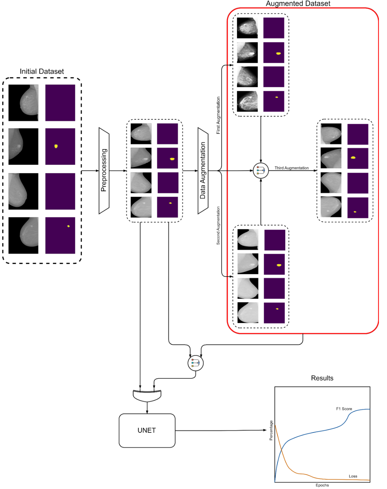
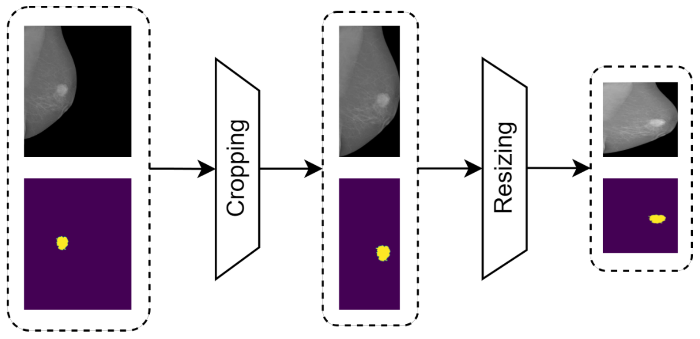
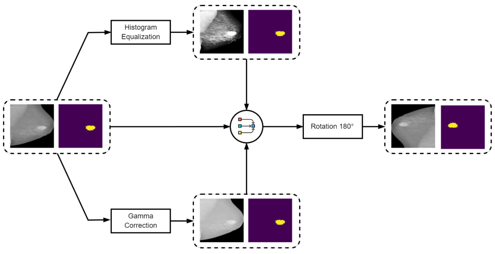
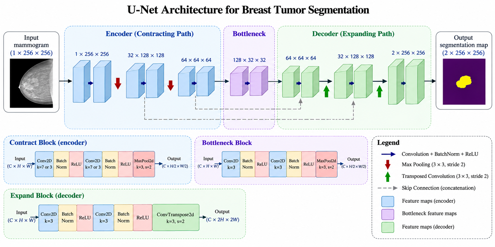
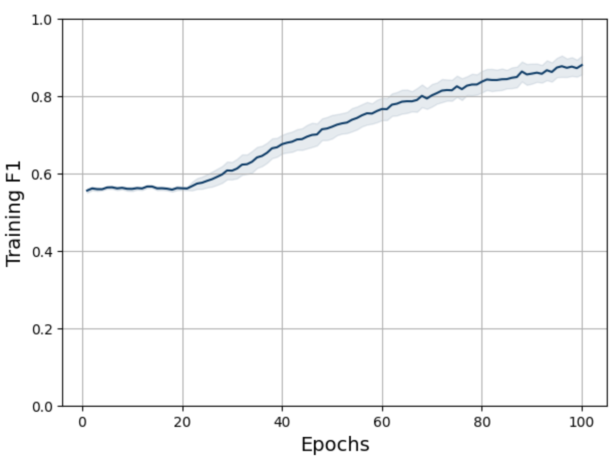
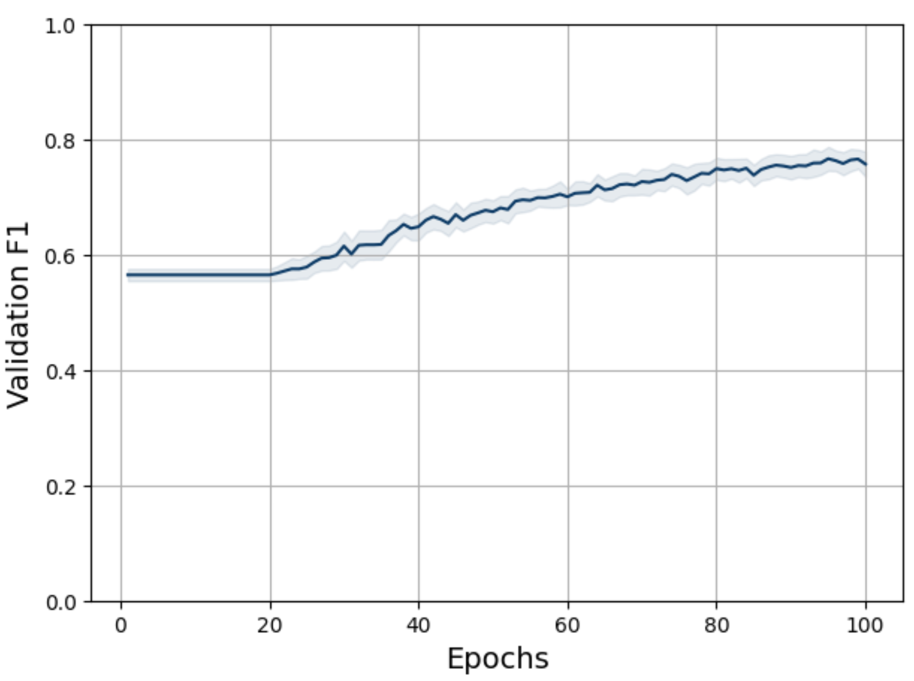

# Breast Tumor Segmentation in Digital Mammograms

Deep learning pipeline for automatic breast tumor segmentation in full-field digital mammograms using a U-Net convolutional neural network.

The project was originally developed as my Diploma Thesis at the National Technical University of Athens (NTUA) and has since been reorganized into a modular and reproducible Python project.

## Overview

Breast tumor segmentation aims to automatically identify tumor regions in mammographic images at the pixel level. This project investigates the use of a U-Net architecture for semantic segmentation of breast masses using the **INbreast** full-field digital mammography dataset.

The study compares training on the original dataset with training on an augmented version generated through histogram equalization, gamma correction, and 180° rotation.

The current repository separates the original experimental notebooks from a cleaned implementation containing reusable modules for data processing, model definition, training, evaluation, and repeated experiment analysis.

## Key Features

- U-Net architecture for pixel-wise breast mass segmentation
- Full-field digital mammograms from the INbreast dataset
- DICOM image and XML annotation processing
- Mammogram cropping, resizing, and normalization
- Histogram equalization and gamma correction
- 180° image and mask rotation
- Original dataset of **410 mammograms**
- Augmented dataset of **2,460 samples**
- Repeated experimental evaluation across multiple configurations
- F1/Dice-based segmentation evaluation
- Automated tests for the main pipeline components
- Reproducible Python environment managed with `uv`

## Dataset

The project uses the **INbreast** dataset, a full-field digital mammography database containing **410 mammograms** together with associated annotations.

The dataset itself is **not included in this repository**.

The expected local directory structure is:

```text
INbreast Release 1.0/
├── AllDICOMs/
├── AllXML/
└── INbreast.csv
```

Mass annotations are extracted from the INbreast XML files and converted into binary segmentation masks.

The current data loader also handles annotation polygons whose rasterized coordinates reach outside the image boundary by retaining only valid image coordinates.

## Methodology

The complete workflow, from the original mammograms and segmentation masks through preprocessing, data augmentation, U-Net training, and performance evaluation, is summarized below.

<p align="center">
  
</p>

### Preprocessing

Each mammogram undergoes the following preprocessing pipeline:

1. DICOM image loading
2. Per-image min-max normalization
3. Removal of zero-valued image borders
4. Corresponding cropping of the segmentation mask
5. Resizing to **256 × 256 pixels**
6. Dataset-level normalization of the image channel

The resulting samples contain a normalized mammogram and its corresponding binary mass mask.

<p align="center">
  
</p>

### Data Augmentation

Two experimental dataset variants are supported.

**Original dataset**

- 410 mammograms

**Augmented dataset**

- 410 original mammograms
- 410 histogram-equalized variants
- 410 gamma-corrected variants
- 1,230 corresponding 180° rotated variants

This produces a total of:

**2,460 mammogram-mask pairs**

The augmentation pipeline follows the experimental procedure used in the thesis.

<p align="center">
  
</p>

### U-Net Architecture

The segmentation model is a U-Net-style convolutional neural network with three contracting and three expanding blocks.

The encoder progressively increases the feature dimensionality:

```text
1 → 32 → 64 → 128
```

while the decoder reconstructs the spatial representation:

```text
128 → 64 → 32 → 2
```

Skip connections concatenate encoder features with the corresponding decoder representations.

The final two output channels represent:

```text
0 — Background
1 — Tumor
```

The model uses convolutional layers, batch normalization, ReLU activations, max pooling, transposed convolutions, and skip connections.

<p align="center">
  
</p>

<p align="center"><em>Architecture of the current PyTorch implementation. Tensor dimensions are shown as channels × height × width (C × H × W).</em></p>

## Experimental Setup

The repository supports eight experimental configurations resulting from the combination of:

| Parameter | Values |
|---|---|
| Dataset | Original / Augmented |
| Learning rate | `0.01` / `0.0001` |
| Epochs | `50` / `100` |
| Optimizer | Adam |
| Loss | Cross-Entropy Loss |
| Batch size | `7` |
| Train / Validation / Test | `70% / 20% / 10%` |

Each configuration is repeated using **20 random seeds (`0–19`)**, resulting in:

**8 configurations × 20 repetitions = 160 training runs**

The same seed sequence is used across configurations to make comparisons between experimental settings more consistent.

Training and validation performance are measured using macro F1/Dice and cross-entropy loss. Repeated-run curves can be summarized using 95% Student's *t* confidence intervals.

## Thesis Results

The original thesis experiments showed a substantial improvement when training with the augmented dataset.

The best reported thesis experiment achieved approximately:

**Test F1/Dice: 0.81**

using the augmented dataset and the lower learning-rate configuration investigated in the original study.

The original-dataset experiments generally produced weaker results, motivating the investigation of data augmentation.

> **Note:** The current repository is a cleaned and modularized implementation of the original research code. Improvements to training/evaluation handling and annotation processing mean that newly executed experiments are not expected to be numerically identical to the historical thesis results.

<table>
  <tr>
    <td align="center"><strong>Training F1</strong></td>
    <td align="center"><strong>Validation F1</strong></td>
  </tr>
  <tr>
    <td></td>
    <td></td>
  </tr>
</table>

The corresponding training and validation loss plots are available in [`assets/results/`](assets/results/).

## Repository Structure

```text
breast-tumor-segmentation/
├── assets/
│   ├── architecture/
│   │   └── unet_architecture.png
│   ├── pipeline/
│   │   ├── augmentation_pipeline.png
│   │   ├── preprocessing_pipeline.png
│   │   └── project_workflow.png
│   └── results/
│       ├── training_f1.png
│       ├── training_loss.png
│       ├── validation_f1.png
│       └── validation_loss.png
│
├── notebooks/
│   ├── training_experiments.ipynb
│   └── results_analysis.ipynb
│
├── scripts/
│   ├── run_training.py
│   └── analyze_results.py
│
├── src/
│   └── breast_tumor_segmentation/
│       ├── __init__.py
│       ├── data.py
│       ├── evaluate.py
│       ├── metrics.py
│       ├── model.py
│       ├── preprocessing.py
│       └── train.py
│
├── tests/
│   ├── test_data.py
│   ├── test_metrics.py
│   ├── test_model.py
│   └── test_preprocessing.py
│
├── .gitignore
├── pyproject.toml
├── README.md
└── uv.lock
```

### Original Notebooks

The `notebooks/` directory contains the original notebook-based implementation developed during the thesis.

They are retained for historical and experimental reference. For the current implementation, **the recommended code to inspect and use is located in `src/` and `scripts/`**.

## Installation

The project uses [uv](https://docs.astral.sh/uv/) for dependency and environment management.

Clone the repository:

```bash
git clone https://github.com/IoannisPan11/breast-tumor-segmentation.git
cd breast-tumor-segmentation
```

Create and synchronize the environment from the lockfile:

```bash
uv sync --locked
```

## Running the Experiments

The training pipeline expects the path to the local INbreast dataset:

```bash
uv run python scripts/run_training.py \
  --data-dir "/path/to/INbreast Release 1.0"
```

Experiment outputs are stored in `results/` by default.

A different output directory can be specified with:

```bash
uv run python scripts/run_training.py \
  --data-dir "/path/to/INbreast Release 1.0" \
  --results-dir "/path/to/results"
```

The complete experiment grid consists of 160 training runs and can therefore require substantial computation.

## Analyzing Results

After the experiments have been completed, the repeated runs can be analyzed with:

```bash
uv run python scripts/analyze_results.py
```

or with a custom results directory:

```bash
uv run python scripts/analyze_results.py \
  --results-dir "/path/to/results"
```

The analysis script aggregates the 20 repetitions of each experimental configuration and generates performance figures.

## Tests

The repository includes automated tests for the main components of the pipeline.

Run them with:

```bash
uv run pytest
```

The test suite currently covers:

- dataset behavior and tensor types
- train/validation/test splitting
- split reproducibility
- DataLoader behavior and reproducibility
- Dice/F1 calculation
- U-Net output shape and numerical validity
- image normalization
- image and mask resizing
- 180° augmentation
- augmented dataset construction

## Reproducibility

Dependencies are defined in `pyproject.toml` and locked in `uv.lock`.

A clean environment can therefore be recreated with:

```bash
uv sync --locked
```

Random seeds control the dataset split, model initialization, and training DataLoader sequence for each repeated run.

Exact bitwise reproducibility across different hardware and accelerator backends is not guaranteed.

## Limitations

The experimental protocol follows the structure of the original thesis. In particular, the augmented dataset is generated before the random train/validation/test split. Consequently, transformed versions originating from the same mammogram may appear in different subsets.

A stricter evaluation protocol would perform the split at the original mammogram level before augmentation, ensuring that all derived variants remain within the same subset.

The cleaned implementation also differs from the historical notebook experiments in several engineering details, including explicit training/evaluation modes, mean batch loss reporting, and boundary-safe annotation processing. Historical thesis metrics should therefore be interpreted as results from the original experimental implementation rather than exact expected outputs of the refactored pipeline.

## Diploma Thesis

This project was developed as part of my Diploma Thesis at the **National Technical University of Athens (NTUA)**.

**Thesis:** *Investigating the potentials of AI on segmenting tumors depicted on digital mammograms*

The work investigated deep learning-based semantic segmentation of breast tumors and the effect of data augmentation on U-Net performance.

## Reference

The INbreast dataset was introduced in:

> Moreira, I. C., Amaral, I., Domingues, I., Cardoso, A., Cardoso, M. J., & Cardoso, J. S. (2012).  
> **INbreast: Toward a Full-field Digital Mammographic Database.**  
> *Academic Radiology, 19*(2), 236–248.  
> https://doi.org/10.1016/j.acra.2011.09.014